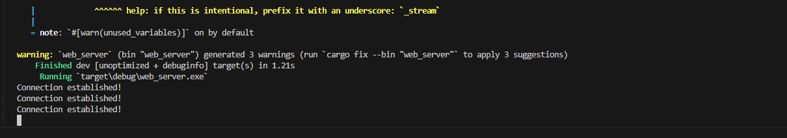
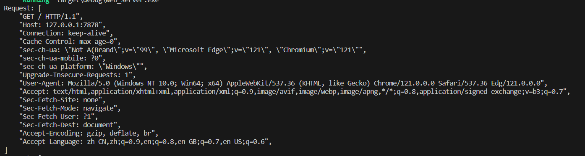
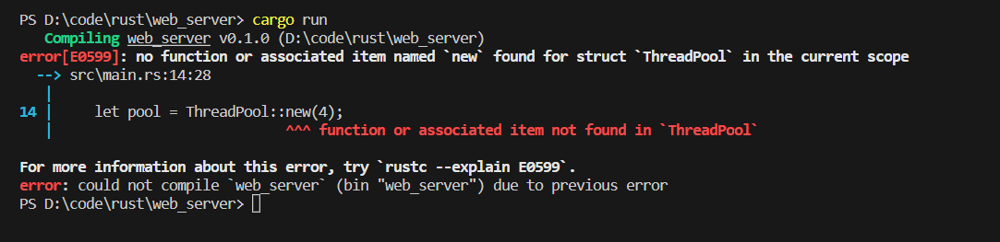
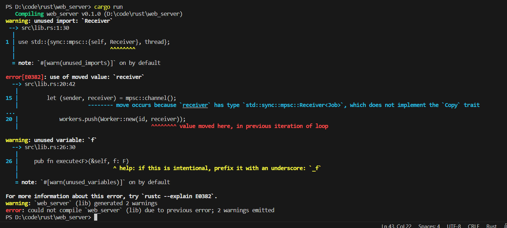

# 构建单线程 web 服务器

计划：

1. 学习一些 TCP 与 HTTP 知识
2. 在套接字（socket）上监听 TCP 请求
3. 解析少量的 HTTP 请求
4. 创建一个合适的 HTTP 响应
5. 通过线程池改善 server 的吞吐量

## 1 预备知识

web server 中涉及到的两个主要协议是 **超文本传输协议**（*Hypertext Transfer Protocol*，*HTTP*）和 **传输控制协议**（*Transmission Control Protocol*，*TCP*）。这两者都是 **请求-响应**（*request-response*）协议，也就是说，有 **客户端**（*client*）来初始化请求，并有 **服务端**（*server*）监听请求并向客户端提供响应。请求与响应的内容由协议本身定义。

TCP 是一个底层协议，它描述了信息如何从一个 server 到另一个的细节，不过其并不指定信息是什么。HTTP 构建于 TCP 之上，它定义了请求和响应的内容。为此，技术上讲可将 HTTP 用于其他协议之上，不过对于绝大部分情况，HTTP 通过 TCP 传输。本项目要做的就是处理 TCP 和 HTTP 请求与响应的原始字节数据。

## 2 监听TCP连接

```rust
use std::net::TcpListener;

fn main() {
    // 监听本机端口为7878的进程
    // 使用unwrap()处理bind绑定失败的结果
    let listener = TcpListener::bind("127.0.0.1:7878").unwrap();
	// incoming方法返回一个迭代器，提供一系列的流（代表客户端和服务端之间的打开的连接）
    // 即客户端连接服务端、服务端生成响应以及服务端关闭连接的全部请求 / 响应过程
    for stream in listener.incoming() {
        let stream = stream.unwrap();
        
        println!("Connnect established!");
    }
}
```

`TcpListener` 用于监听 TCP 连接。我们选择监听地址 `127.0.0.1:7878`。将这个地址拆开，冒号之前的部分是一个代表本机的 IP 地址（这个地址在每台计算机上都相同，并不特指作者的计算机），而 `7878` 是端口。选择这个端口出于两个原因：通常 HTTP 接受这个端口而且 7878 在电话上打出来就是 "rust"（译者注：九宫格键盘上的英文）。

在这个场景中 `bind` 函数类似于 `new` 函数，在这里它返回一个新的 `TcpListener` 实例。这个函数叫做 `bind` 是因为，在网络领域，连接到监听端口被称为 “绑定到一个端口”（“binding to a port”）。

`bind` 函数返回 `Result<T, E>`，这表明绑定可能会失败，例如，连接 80 端口需要管理员权限（非管理员用户只能监听大于 1024 的端口），所以如果不是管理员尝试连接 80 端口，则会绑定失败。另一个例子是如果运行两个此程序的实例这样会有两个程序监听相同的端口，绑定会失败。因为我们是出于学习目的来编写一个基础的 server，将不用关心处理这类错误，使用 `unwrap` 在出现这些情况时直接停止程序。

`TcpListener` 的 `incoming` 方法返回一个迭代器，它提供了一系列的流（更准确的说是 `TcpStream` 类型的流）。**流**（*stream*）代表一个客户端和服务端之间打开的连接。**连接**（*connection*）代表客户端连接服务端、服务端生成响应以及服务端关闭连接的全部请求 / 响应过程。为此，`TcpStream` 允许我们读取它来查看客户端发送了什么，并可以编写响应。总体来说，这个 `for` 循环会依次处理每个连接并产生一系列的流供我们处理。

运行结果：首先在终端执行 `cargo run`，接着在浏览器中加载 `127.0.0.1:7878`

```bash
cargo run
```



浏览器端


浏览器会显示出看起来类似于“连接重置”（“Connection reset”）的错误信息，因为 server 目前并没响应任何数据。但是如果观察终端，会发现当浏览器连接 server 时会打印出一系列的信息！

## 3 读取请求

实现读取来自浏览器请求的功能！为了分离获取连接和接下来对连接的操作的相关内容，开始一个新函数来处理连接。在这个新的 `handle_connection` 函数中，从 TCP 流中读取数据并打印出来以便观察浏览器发送过来的数据。

```rust
use std::io::prelude::*;            // 获取读写流所需的特定 trait
use std::net::TcpStream;
use std::net::TcpListener;

fn main() {
    // 监听本机端口为7878的进程
    // 使用unwrap()处理bind绑定失败的结果
    let listener = TcpListener::bind("127.0.0.1:7878").unwrap();
	// incoming方法返回一个迭代器，提供一系列的流（代表客户端和服务端之间的打开的连接）
    // 即客户端连接服务端、服务端生成响应以及服务端关闭连接的全部请求 / 响应过程
    for stream in listener.incoming() {
        let stream = stream.unwrap();
        handle_connection(stream);
    }
}


// 处理连接
// 参数是可变的
// 功能是从 TCP 连接中读取 HTTP 请求的头部信息，并将其打印出来。
fn handle_connection(mut stream: TcpStream) {
    // 从stream中读取数据并且存到buf_reader
    let buf_reader = BufReader::new(&mut stream);
    
    // 定义一个Vec<_>类型的变量http_request
    // 使用 .lines() 方法从 buf_reader 中获取每行数据。
    // .lines(): 这个方法返回一个迭代器，表示从输入流中读取的每一行。
    // 调用了 .map() 方法，对每个 Result 进行操作。
    // 使用 .unwrap() 方法将 Result 解包，如果是 Ok 就返回其中的字符串，如果是 Err 则会 panic。
    // 使用 .take_while() 方法，只要当前行不为空就一直获取行数据。这会在遇到空行（HTTP请求头结束标志）时停止获取。
    // 使用 .collect() 方法将迭代器收集成一个 Vec<_> 向量，也就是将所有的 HTTP 请求头信息存储在 http_request 中。
    let http_request: Vec<_> = buf_reader
        .lines()
        .map(|result| result.unwrap())
        .take_while(|line| !line.is_empty())
        .collect();

    println!("Request: {:#?}", http_request);
}
```

这里将 `std::io::prelude` 引入作用域来获取读写流所需的特定 trait。在 `main` 函数的 `for` 循环中，相比获取到连接时打印信息，现在调用新的 `handle_connection` 函数并向其传递 `stream`。

在 `handle_connection` 中，`stream` 参数是可变的。这是因为 `TcpStream` 实例在内部记录了所返回的数据。它可能读取了多于我们请求的数据并保存它们以备下一次请求数据。因此它需要是 `mut` 的因为其内部状态可能会改变；通常我们认为 “读取” 不需要可变性，不过在这个例子中则需要 `mut` 关键字。

BufReader` 可以实现缓冲区读取，底层其实是基于 `std::io::Read 实现

可以使用 `lines` 方法来获取一个迭代器，可以对传输的内容流进行按行迭代读取，要使用该方法，必须先引入 `std::io::BufRead`

最后使用 `collect` 消费掉迭代器，最终客户端发来的请求数据被存到 `http_request` 这个动态数组中



```bash
Request: [
    "GET / HTTP/1.1",
    "Host: 127.0.0.1:7878",
    "Connection: keep-alive",
    "Cache-Control: max-age=0",
    "sec-ch-ua: \"Not A(Brand\";v=\"99\", \"Microsoft Edge\";v=\"121\", \"Chromium\";v=\"121\"",
    "sec-ch-ua-mobile: ?0",
    "sec-ch-ua-platform: \"Windows\"",
    "Upgrade-Insecure-Requests: 1",
    "User-Agent: Mozilla/5.0 (Windows NT 10.0; Win64; x64) AppleWebKit/537.36 (KHTML, like Gecko) Chrome/121.0.0.0 Safari/537.36 Edg/121.0.0.0",
    "Accept: text/html,application/xhtml+xml,application/xml;q=0.9,image/avif,image/webp,image/apng,*/*;q=0.8,application/signed-exchange;v=b3;q=0.7",
    "Sec-Fetch-Site: none",
    "Sec-Fetch-Mode: navigate",
    "Sec-Fetch-User: ?1",
    "Sec-Fetch-Dest: document",
    "Accept-Encoding: gzip, deflate, br",
    "Accept-Language: zh-CN,zh;q=0.9,en;q=0.8,en-GB;q=0.7,en-US;q=0.6",
]
```

### 3.1 仔细观察HTTP请求

HTTP 是一个基于文本的协议，同时一个请求有如下格式：

```bash
Method Request-URI HTTP-Version CRLF
headers CRLF
message-body
```

第一行叫做 **请求行**（*request line*），它存放了客户端请求了什么的信息。请求行的第一部分是所使用的 *method*，比如 `GET` 或 `POST`，这描述了客户端如何进行请求。**这里客户端使用了 `GET` 请求。**

请求行接下来的部分是 */*，它代表客户端请求的 **统一资源标识符**（*Uniform Resource Identifier*，*URI*） —— URI 大体上类似，但也不完全类似于 URL（**统一资源定位符**，*Uniform Resource Locators*）。URI 和 URL 之间的区别对于本章的目的来说并不重要，不过 HTTP 规范使用术语 URI，所以这里可以简单的将 URL 理解为 URI。

最后一部分是客户端使用的HTTP版本，然后请求行以 **CRLF序列** （CRLF代表回车和换行，*carriage return line feed*，这是打字机时代的术语！）结束。CRLF序列也可以写成`\r\n`，其中`\r`是回车符，`\n`是换行符。 CRLF序列将请求行与其余请求数据分开。 请注意，打印CRLF时，我们会看到一个新行，而不是`\r\n`。

观察目前运行程序所接收到的数据的请求行，可以看到 `GET` 是 method，*/* 是请求 URI，而 `HTTP/1.1` 是版本。

从 `Host:` 开始的其余的行是 headers；`GET` 请求没有 body。

如果你希望的话，尝试用不同的浏览器发送请求，或请求不同的地址，比如 `127.0.0.1:7878/test`，来观察请求数据如何变化。

```bash
Request: [
    "GET /test HTTP/1.1",
    "Host: 127.0.0.1:7878",
    "Connection: keep-alive",
    "Cache-Control: max-age=0",
    "sec-ch-ua: \"Not A(Brand\";v=\"99\", \"Microsoft Edge\";v=\"121\", \"Chromium\";v=\"121\"",
    "sec-ch-ua-mobile: ?0",
    "sec-ch-ua-platform: \"Windows\"",
    "Upgrade-Insecure-Requests: 1",
    "User-Agent: Mozilla/5.0 (Windows NT 10.0; Win64; x64) AppleWebKit/537.36 (KHTML, like Gecko) Chrome/121.0.0.0 Safari/537.36 Edg/121.0.0.0",
    "Accept: text/html,application/xhtml+xml,application/xml;q=0.9,image/avif,image/webp,image/apng,*/*;q=0.8,application/signed-exchange;v=b3;q=0.7",
    "Sec-Fetch-Site: none",
    "Sec-Fetch-Mode: navigate",
    "Sec-Fetch-User: ?1",
    "Sec-Fetch-Dest: document",
    "Accept-Encoding: gzip, deflate, br",
    "Accept-Language: zh-CN,zh;q=0.9,en;q=0.8,en-GB;q=0.7,en-US;q=0.6",
]
```

观察目前运行程序所接收到的数据的请求行，可以看到 `GET` 是 method，*/* test是请求 URI，而 `HTTP/1.1` 是版本。

## 4 编写响应

实现在客户端请求的响应中发送数据的功能。响应有如下格式：

```bash
HTTP-Version Status-Code Reason-Phrase CRLF
headers CRLF
message-body
```

第一行叫做 **状态行**（*status line*），它包含响应的 HTTP 版本、一个数字状态码用以总结请求的结果和一个描述之前状态码的文本原因短语。CRLF 序列之后是任意 header，另一个 CRLF 序列，和响应的 body。

这里是一个使用 HTTP 1.1 版本的响应例子，其状态码为 200，原因短语为 OK，没有 header，也没有 body：

```bash
HTTP/1.1 200 OK\r\n\r\n
```

状态码 200 是一个标准的成功响应。这些文本是一个微型的成功 HTTP 响应。将这些文本写入流作为成功请求的响应！在 `handle_connection` 函数中，我们需要去掉打印请求数据的 `println!`，并替换下面的代码

```rust
// 处理连接
// 参数是可变的
// 从 TCP 连接中读取 HTTP 请求的头部信息，然后发送一个简单的 HTTP 200 OK 响应。
fn handle_connection(mut stream: TcpStream) {
    // 从stream中读取数据并且存到buf_reader
    let buf_reader = BufReader::new(&mut stream);
    
    // 定义一个Vec<_>类型的变量http_request
    // 使用 .lines() 方法从 buf_reader 中获取每行数据。
    // .lines(): 这个方法返回一个迭代器，表示从输入流中读取的每一行。
    // 调用了 .map() 方法，对每个 Result 进行操作。
    // 使用 .unwrap() 方法将 Result 解包，如果是 Ok 就返回其中的字符串，如果是 Err 则会 panic。
    // 使用 .take_while() 方法，只要当前行不为空就一直获取行数据。这会在遇到空行（HTTP请求头结束标志）时停止获取。
    // 使用 .collect() 方法将迭代器收集成一个 Vec<_> 向量，也就是将所有的 HTTP 请求头信息存储在 http_request 中。
    let http_request: Vec<_> = buf_reader
        .lines()
        .map(|result| result.unwrap())
        .take_while(|line| !line.is_empty())
        .collect();
    
    let response = "HTTP/1.1 200 OK\r\n\r\n";
	// 将定义的 HTTP 响应消息写入到 TCP 连接中。
    // as_bytes() 方法将字符串转换为字节流，然后使用 write_all() 方法将字节流写入到连接中。
    // .unwrap() 用于处理可能的写入错误。
    stream.write_all(response.as_bytes()).unwrap();
}
```

由于 `write_all` 方法接受 `&[u8]` 类型作为参数，这里需要用 `as_bytes` 将字符串转换为字节数组。。

有了这些修改，运行我们的代码并进行请求！不再向终端打印任何数据，所以不会再看到除了 Cargo 以外的任何输出。不过当在浏览器中加载 *127.0.0.1:7878* 时，会得到一个空页面而不是错误。

## 5 返回真正的HTML

在项目根目录创建一个新文件，*hello.html* —— 也就是说，不是在 `src` 目录。在此可以放入任何你期望的 HTML

```html
<!DOCTYPE html>
<html lang="en">
    <head>
        <meta charset="utf-8">
        <title>Hello</title>
    </head>
    <body>
        <h1>hello world</h1>
        <p>Hi from Rust</p>
    </body>
</html>
```

这是一个极小化的 HTML5 文档，它有一个标题和一小段文本。为了在 server 接受请求时返回它，修改 `handle_connection` 来读取 HTML 文件，将其加入到响应的 body 中，并发送：

```rust
use std::{
    fs,
    io::{prelude::*, BufReader},
    net::{TcpListener, TcpStream},
};

// 处理连接
// 参数是可变的
// 功能是从 TCP 连接中读取 HTTP 请求的头部信息，然后发送一个带有 HTML 内容的 HTTP 200 OK 响应。
fn handle_connection(mut stream: TcpStream) {
    // 从stream中读取数据并且存到buf_reader
    let buf_reader = BufReader::new(&mut stream);
    
    // 定义一个Vec<_>类型的变量http_request
    // 使用 .lines() 方法从 buf_reader 中获取每行数据。
    // .lines(): 这个方法返回一个迭代器，表示从输入流中读取的每一行。
    // 调用了 .map() 方法，对每个 Result 进行操作。
    // 使用 .unwrap() 方法将 Result 解包，如果是 Ok 就返回其中的字符串，如果是 Err 则会 panic。
    // 使用 .take_while() 方法，只要当前行不为空就一直获取行数据。这会在遇到空行（HTTP请求头结束标志）时停止获取。
    // 使用 .collect() 方法将迭代器收集成一个 Vec<_> 向量，也就是将所有的 HTTP 请求头信息存储在 http_request 中。
    let http_request: Vec<_> = buf_reader
        .lines()
        .map(|result| result.unwrap())
        .take_while(|line| !line.is_empty())
        .collect();

    let status_line = "HTTP/1.1 200 OK";
    // 读"hello.html"，并且存储到contents中
    let contents = fs::read_to_string("hello.html").unwrap();
    let length = contents.len();
	// 这里使用了 format! 宏创建了一个 HTTP 响应消息。{status_line}、{length} 和 {contents} 是占位符，
    // 会被 status_line、length 和 contents 变量的值替换。
    let response =
        format!("{status_line}\r\nContent-Length: {length}\r\n\r\n{contents}");
    
	// 将定义的 HTTP 响应消息写入到 TCP 连接中。
    // as_bytes() 方法将字符串转换为字节流，然后使用 write_all() 方法将字节流写入到连接中。
    // .unwrap() 用于处理可能的写入错误。
    stream.write_all(response.as_bytes()).unwrap();
}
```

新修改的代码中，读取了新增 HTML 的内容，并按照 HTTP 格式，将内容传回给客户端。

具体的运行验证就不再赘述，我们再来看看如何增加一些验证和选择性回复。

使用 `cargo run` 运行程序，在浏览器加载 127.0.0.1:7878


## 6 验证请求并有选择的进行响应

目前web server 不管客户端请求什么都会返回相同的 HTML 文件。增加在返回 HTML 文件前检查浏览器是否请求 */*，并在其请求任何其他内容时返回错误的功能。为此需要如下那样修改 `handle_connection`。新代码接收到的请求的内容与已知的 */* 请求的一部分做比较，并增加了 `if` 和 `else` 块来区别处理请求：

```rust
fn handle_connection(mut stream: TcpStream) {
    // 从stream中读取数据并且存到buf_reader
    let buf_reader = BufReader::new(&mut stream);
    // 获取请求行数据(第一行数据)
    let request_line = buf_reader.lines().next().unwrap().unwrap();

    if request_line == "GET / HTTP/1.1" {
        let status_line = "HTTP/1.1 200 OK";
        // 读"hello.html"，并且存储到contents中
        let contents = fs::read_to_string("hello.html").unwrap();
        let length = contents.len();
        
		// 这里使用了 format! 宏创建了一个 HTTP 响应消息。{status_line}、{length} 和 {contents} 是占位符，
    	// 会被 status_line、length 和 contents 变量的值替换。
        let response = format!(
            "{status_line}\r\nContent-Length: {length}\r\n\r\n{contents}"
        );
		// 将定义的 HTTP 响应消息写入到 TCP 连接中。
    	// as_bytes() 方法将字符串转换为字节流，然后使用 write_all() 方法将字节流写入到连接中。
    	// .unwrap() 用于处理可能的写入错误。
        stream.write_all(response.as_bytes()).unwrap();
    } else {
        // some other request
    }
}
```

注意迭代器方法 `next` 的使用，原因在于我们只需要读取第一行，判断具体的 HTTP METHOD 是什么。

接着判断了用户是否请求了 `/` 根路径，如果是，返回之前的 `hello.html` 页面；如果不是...尚未实现。

重新运行服务器，如果你继续访问 `127.0.0.1:7878` ，那么看到的依然是 `hello.html` 页面，因为默认访问根路径，但是一旦换一个路径访问，例如 `127.0.0.1:7878/something-else`，那你将继续看到之前看过多次的连接错误。

下面来完善下，当用户访问根路径之外的页面时，给他展示一个友好的 404 页面( 相比直接报错 )。

```rust
// 处理连接
// 参数是可变的
fn handle_connection(mut stream: TcpStream) {
    let buf_reader = BufReader::new(&mut stream);
    // 获取请求行数据(第一行数据)
    let request_line = buf_reader.lines().next().unwrap().unwrap();

    if request_line == "GET / HTTP/1.1" {
        let status_line = "HTTP/1.1 200 OK";
        let contents = fs::read_to_string("hello.html").unwrap();
        let length = contents.len();

        let response = format!(
            "{status_line}\r\nContent-Length: {length}\r\n\r\n{contents}"
        );
		// 将定义的 HTTP 响应消息写入到 TCP 连接中。
    	// as_bytes() 方法将字符串转换为字节流，然后使用 write_all() 方法将字节流写入到连接中。
    	// .unwrap() 用于处理可能的写入错误。
        stream.write_all(response.as_bytes()).unwrap();
    } else {
        // some other request
        let status_line = "HTTP/1.1 404 NOT FOUND";
        // 读404.html
        let contents = fs::read_to_string("404.html").unwrap();
        let length = contents.len();
        
		// 这里使用了 format! 宏创建了一个 HTTP 响应消息。{status_line}、{length} 和 {contents} 是占位符，
    	// 会被 status_line、length 和 contents 变量的值替换。
        let response = format!(
            "{status_line}\r\nContent-Length: {length}\r\n\r\n{contents}"
        );
        
		// 将定义的 HTTP 响应消息写入到 TCP 连接中。
    	// as_bytes() 方法将字符串转换为字节流，然后使用 write_all() 方法将字节流写入到连接中。
    	// .unwrap() 用于处理可能的写入错误。
        stream.write_all(response.as_bytes()).unwrap();
    }
}
```

别忘了在根路径下创建 `404.html`并填入下面内容:

```html
<!DOCTYPE html>
<html lang="en">
  <head>
    <meta charset="utf-8">
    <title>Hello!</title>
  </head>
  <body>
    <h1>Oops!</h1>
    <p>Sorry, I don't know what you're asking for.</p>
  </body>
</html>
```

测试

```bash 
http://127.0.0.1:7878/test
```


最后，上面的代码其实有很多重复，可以提取出来进行简单重构:

```rust
fn handle_connection(mut stream: TcpStream) {
    let buf_reader = BufReader::new(&mut stream);
    // 获取请求行数据(第一行数据)
    let request_line = buf_reader.lines().next().unwrap().unwrap();
	// 如果请求行是"GET / HTTP/1.1",status_line = "HTTP/1.1 200 OK"，filename = hello.html
    // 否则status_line = "HTTP/1.1 404 NOT FOUND"，filename = 404.html
    let (status_line, filename) = if request_line == "GET / HTTP/1.1" {
        ("HTTP/1.1 200 OK", "hello.html")
    } else {
        ("HTTP/1.1 404 NOT FOUND", "404.html")
    };
	// 读文件
    let contents = fs::read_to_string(filename).unwrap();
    let length = contents.len();
    
	// 这里使用了 format! 宏创建了一个 HTTP 响应消息。{status_line}、{length} 和 {contents} 是占位符，
    // 会被 status_line、length 和 contents 变量的值替换。
    let response =
        format!("{status_line}\r\nContent-Length: {length}\r\n\r\n{contents}");
    
	// 将定义的 HTTP 响应消息写入到 TCP 连接中。
    // as_bytes() 方法将字符串转换为字节流，然后使用 write_all() 方法将字节流写入到连接中。
    // .unwrap() 用于处理可能的写入错误。
    stream.write_all(response.as_bytes()).unwrap();
}
```

## 7 总的代码

```rust
use std::{
    fs,
    io::{prelude::*, BufReader},
    net::{TcpListener, TcpStream},
};

fn main() {
    // 监听本机端口为7878的进程
    // 使用unwrap()处理bind绑定失败的结果
    let listener = TcpListener::bind("127.0.0.1:7878").unwrap();
	// incoming方法返回一个迭代器，提供一系列的流（代表客户端和服务端之间的打开的连接）
    // 即客户端连接服务端、服务端生成响应以及服务端关闭连接的全部请求 / 响应过程
    for stream in listener.incoming() {
        let stream = stream.unwrap();
        // 处理连接
        handle_connection(stream);
    }
}


// 处理连接
// 参数是可变的
fn handle_connection(mut stream: TcpStream) {
    // 从stream中读取数据并且存到buf_reader
    let buf_reader = BufReader::new(&mut stream);
    // 获取请求行数据(第一行数据)
    let request_line = buf_reader.lines().next().unwrap().unwrap();
	
    // 如果请求行是"GET / HTTP/1.1",status_line = "HTTP/1.1 200 OK"，filename = hello.html
    // 否则status_line = "HTTP/1.1 404 NOT FOUND"，filename = 404.html
    let (status_line, filename) = if request_line == "GET / HTTP/1.1" {
        ("HTTP/1.1 200 OK", "hello.html")
    } else {
        ("HTTP/1.1 404 NOT FOUND", "404.html")
    };
	// 读文件
    let contents = fs::read_to_string(filename).unwrap();
    let length = contents.len();
    
	// 这里使用了 format! 宏创建了一个 HTTP 响应消息。{status_line}、{length} 和 {contents} 是占位符，
    // 会被 status_line、length 和 contents 变量的值替换。
    let response =
        format!("{status_line}\r\nContent-Length: {length}\r\n\r\n{contents}");

    // 将定义的 HTTP 响应消息写入到 TCP 连接中。
    // as_bytes() 方法将字符串转换为字节流，然后使用 write_all() 方法将字节流写入到连接中。
    // .unwrap() 用于处理可能的写入错误。
    stream.write_all(response.as_bytes()).unwrap();
}
```

# 构建单线程 Web 服务器

目前的单线程版本只能依次处理用户的请求：一时间只能处理一个请求连接。随着用户的请求数增多，可以预料的是排在后面的用户可能要等待数十秒甚至超时！

本章我们将解决这个问题，但是首先来模拟一个慢请求场景，看看单线程是否真的如此糟糕。

## 1 基于单线程模拟慢请求

下面的代码中，使用 sleep 的方式让每次请求持续 5 秒，模拟真实的慢请求:

```rust
// in main.rs
use std::{
    fs,
    io::{prelude::*, BufReader},
    net::{TcpListener, TcpStream},
    thread,
    time::Duration,
};
// --snip--

fn handle_connection(mut stream: TcpStream) {
    // --snip--

    let (status_line, filename) = match &request_line[..] {
        "GET / HTTP/1.1" => ("HTTP/1.1 200 OK", "hello.html"),
        "GET /sleep HTTP/1.1" => {
            thread::sleep(Duration::from_secs(5));
            ("HTTP/1.1 200 OK", "hello.html")
        }
        _ => ("HTTP/1.1 404 NOT FOUND", "404.html"),
    };

    // --snip--
}
```

由于增加了新的请求路径 `/sleep`，之前的 `if else` 被修改为 `match`，需要注意的是，由于 `match` 不会像方法那样自动做引用或者解引用，因此我们需要显式调用: `match &request_line[..]` ，来获取所需的 `&str` 类型。

可以看出，当用户访问 `/sleep` 时，请求会持续 5 秒后才返回，下面来试试，启动服务器后，打开你的浏览器，这次要分别打开两个页面(tab页): `http://127.0.0.1:7878/` 和 `http://127.0.0.1:7878/sleep`。

此时，如果我们连续访问 `/` 路径，那效果跟之前一样：立刻看到请求的页面。但假如先访问 `/sleep` ，接着在另一个页面访问 `/`，就会看到 `/` 的页面直到 5 秒后才会刷出来，验证了请求排队这个糟糕的事实。

## 2 使用线程池改善吞吐

线程池包含一组已生成的线程，它们时刻等待着接收并处理新的任务。当程序接收到新任务时，它会将线程池中的一个线程指派给该任务，在该线程忙着处理时，新来的任务会交给池中剩余的线程进行处理。最终，当执行任务的线程处理完后，它会被重新放入到线程池中，准备处理新任务。

假设线程池中包含 N 个线程，那么可以推断出，服务器将拥有并发处理 N 个请求连接的能力，从而增加服务器的吞吐量。

同时，我们将限制线程池中的线程数量，以保护服务器免受拒绝服务攻击（DoS）的影响：如果针对每个请求创建一个新线程，那么一个人向我们的服务器发出1000万个请求，会直接耗尽资源，导致后续用户的请求无法被处理，这也是拒绝服务名称的来源。

**因此，还需对线程池进行一定的架构设计，首先是设定最大线程数的上限，其次维护一个请求队列。池中的线程去队列中依次弹出请求并处理。这样就可以同时并发处理 N 个请求，其中 N 是线程数。**

但聪明的读者可能会想到，假如每个请求依然耗时很长，那请求队列依然会堆积，后续的用户请求还是需要等待较长的时间，毕竟你也就 N 个线程，但总归比单线程要强 N 倍吧 :D

当然，线程池依然是较为传统的提升吞吐方法，比较新的有：单线程异步 IO，例如 redis；多线程异步 IO，例如 Rust 的主流 web 框架。

### 2.1 为每个请求生成一个线程

```rust
fn main() {
    let listener = TcpListener::bind("127.0.0.1:7878").unwrap();

    for stream in listener.incoming() {
        let stream = stream.unwrap();

        thread::spawn(|| {
            handle_connection(stream);
        });
    }
}
```

这种实现下，依次访问 `/sleep` 和 `/` 就无需再等待，不错的开始。

### 2.2 限制创建线程的数量

原则上，我们希望在上面代码的基础上，尽量少的去修改，下面是一个假想的线程池 API 实现:

```rust
fn main() {
    let listener = TcpListener::bind("127.0.0.1:7878").unwrap();
    let pool = ThreadPool::new(4);

    for stream in listener.incoming() {
        let stream = stream.unwrap();

        pool.execute(|| {
            handle_connection(stream);
        });
    }
}
```

代码跟之前的类似，也非常简洁明了， `ThreadPool::new(4)` 创建一个包含 4 个线程的线程池，接着通过 `pool.execute` 去分发执行请求。

显然，上面的代码无法编译，下面来逐步实现。

### 2.3 使用编译器驱动的方式开发 ThreadPool

你可能听说过测试驱动开发，但听过编译器驱动开发吗？来见识下 Rust 中的绝招吧。

检查之前的代码，看看报什么错:


俗话说，不怕敌人很强，就怕他们不犯错。很好，编译器漏出了破绽。看起来我们需要实现 `ThreadPool` 类型。看起来，还需要添加一个库包，未来线程池的代码都将在这个独立的包中完成，甚至于未来你要实现其它的服务，也可以复用这个多线程库包。

创建 `src/lib.rs` 文件并写入如下代码:

``` 
pub struct ThreadPool;
```

接着在 `main.rs` 中引入:

```rust
// main.rs
use hello::ThreadPool;
```

编译后依然报错:



继续实现 `new` 函数 :

```rust
pub struct ThreadPool;

impl ThreadPool {
    pub fn new(size : usize) -> ThreadPool{
        ThreadPool
    }
}
```

继续检查：


这个方法类似于 `thread::spawn`，用于将闭包中的任务交给某个空闲的线程去执行。

其实这里有一个小难点：`execute` 的参数是一个闭包，回忆下之前学过的内容，闭包作为参数时可以由三个特征进行约束: `Fn`、`FnMut` 和 `FnOnce`，选哪个就成为一个问题。由于 `execute` 在实现上类似 `thread::spawn`，我们可以参考下后者的签名如何声明。

```rust
pub fn spawn<F, T>(f: F) -> JoinHandle<T>
    where
        F: FnOnce() -> T,
        F: Send + 'static,
        T: Send + 'static,
```

可以看出，`spawn` 选择 `FnOnce` 作为 `F` 闭包的特征约束，原因是闭包作为任务只需被线程执行一次即可。

`F` 还有一个特征约束 `Send` ，也可以照抄过来，毕竟闭包需要从一个线程传递到另一个线程，至于生命周期约束 `'static`，是因为我们并不知道线程需要多久时间来执行该任务。

```rust
impl ThreadPool {
    // --snip--
    pub fn execute<F>(&self, f: F)
    where
        F: FnOnce() + Send + 'static,
    {
    }
}
```

在理解 `spawn` 后，就可以轻松写出如上的 `execute` 实现，注意这里的 `FnOnce()` 跟 `spawn` 有所不同，原因是要 `execute` 传入的闭包没有参数也没有返回值。


成功编译，但在浏览器访问依然会报之前类似的错误，下面来实现 `execute`。

### 2.4 new 还是 build

关于 `ThreadPool` 的构造函数，存在两个选择 `new` 和 `build`。

`new` 往往用于简单初始化一个实例，而 `build` 往往会完成更加复杂的构建工作，例如入门实战中的 `Config::build`。

在这个项目中，我们并不需要在初始化线程池的同时创建相应的线程，因此 `new` 是更适合的选择:

```rust
impl ThreadPool {
    /// Create a new ThreadPool.
    ///
    /// The size is the number of threads in the pool.
    ///
    /// # Panics
    ///
    /// The `new` function will panic if the size is zero.
    pub fn new(size: usize) -> ThreadPool {
        assert!(size > 0);

        ThreadPool
    }

    // --snip--
}
```

这里有两点值得注意:

- `usize` 类型包含 `0`，但是创建没有任何线程的线程池显然是无意义的，因此做一下 `assert!` 验证
- `ThreadPool` 拥有不错的[文档注释](https://course.rs/basic/comment.html#文档注释)，甚至包含了可能 `panic` 的情况，通过 `cargo doc --open` 可以访问文档注释

### 2.5 存储线程

创建 `ThreadPool` 后，下一步就是存储具体的线程，既然要存放线程，一个绕不过去的问题就是：用什么类型来存放，例如假如使用 `Vec<T>` 来存储，那这个 `T` 应该是什么？

估计还得探索下 `thread::spawn` 的签名，毕竟它生成并返回一个线程:

```rust
pub fn spawn<F, T>(f: F) -> JoinHandle<T>
    where
        F: FnOnce() -> T,
        F: Send + 'static,
        T: Send + 'static,
```

看起来 `JoinHandle<T>` 是我们需要的，这里的 `T` 是传入的闭包任务所返回的，我们的任务无需任何返回，因此 `T` 直接使用 `()` 即可。

```rust
use std::thread;

pub struct ThreadPool {
    threads: Vec<thread::JoinHandle<()>>,
}

impl ThreadPool {
    // --snip--
    pub fn new(size: usize) -> ThreadPool {
        assert!(size > 0);

        let mut threads = Vec::with_capacity(size);

        for _ in 0..size {
            // create some threads and store them in the vector
        }

        ThreadPool { threads }
    }
    // --snip--
}
```

如上所示，最终我们使用 `Vec<thread::JoinHandle<()>>` 来存储线程，同时设定了容量上限 `with_capacity(size)`，该方法还可以提前分配好内存空间，比 `Vec::new` 的性能要更好一点。

### 2.6 将代码从 ThreadPool 发送到线程中

上面的代码留下一个未实现的 `for` 循环，用于创建和存储线程。

学过多线程一章后，大家应该知道 `thread::spawn` 虽然是生成线程最好的方式，但是它会立即执行传入的任务，然而，在我们的使用场景中，创建线程和执行任务明显是要分离的，因此标准库看起来不再适合。

可以考虑创建一个 `Worker` 结构体，作为 `ThreadPool` 和任务线程联系的桥梁，它的任务是获得将要执行的代码，然后在具体的线程中去执行。想象一个场景：一个餐馆，`Worker` 等待顾客的点餐，然后将具体的点餐信息传递给厨房，感觉类似服务员？

引入 `Worker` 后，就无需再存储 `JoinHandle<()>` 实例，直接存储 `Worker` 实例：该实例内部会存储 `JoinHandle<()>`。下面是新的线程池创建流程:

```rust
use std::thread;

pub struct ThreadPool {
    workers: Vec<Worker>,
}

impl ThreadPool {
    // --snip--
    pub fn new(size: usize) -> ThreadPool {
        assert!(size > 0);

        let mut workers = Vec::with_capacity(size);

        for id in 0..size {
            workers.push(Worker::new(id));
        }

        ThreadPool { workers }
    }
    // --snip--
}

struct Worker {
    id: usize,
    thread: thread::JoinHandle<()>,
}

impl Worker {
    fn new(id: usize) -> Worker {
        // 尚未实现..
        let thread = thread::spawn(|| {});
        // 每个 `Worker` 都拥有自己的唯一 id
        Worker { id, thread }
    }
}
```

到这里代码可以编译通过

### 2.7 将请求发送给线程

在上面的代码中， `thread::spawn(|| {})` 还没有给予实质性的内容，现在一起来完善下。

首先 `Worker` 结构体需要从线程池 `TreadPool` 的队列中获取待执行的代码，对于这类场景，消息传递非常适合：我们将使用消息通道( channel )作为任务队列。

```rust
use std::{sync::mpsc, thread};

pub struct ThreadPool {
    workers: Vec<Worker>,
    sender: mpsc::Sender<Job>,
}

struct Job;

impl ThreadPool {
    // --snip--
    pub fn new(size: usize) -> ThreadPool {
        assert!(size > 0);

        let (sender, receiver) = mpsc::channel();

        let mut workers = Vec::with_capacity(size);

        for id in 0..size {
            workers.push(Worker::new(id));
        }

        ThreadPool { workers, sender }
    }
    // --snip--
}

```

阅读过之前内容的同学应该知道，消息通道有发送端和接收端，其中线程池 `ThreadPool` 持有发送端，通过 `execute` 方法来发送任务。那么问题来了，谁持有接收端呢？答案是 `Worker`，它的内部线程将接收任务，然后进行处理。

```rust
impl ThreadPool {
    // --snip--
    pub fn new(size: usize) -> ThreadPool {
        assert!(size > 0);

        let (sender, receiver) = mpsc::channel();

        let mut workers = Vec::with_capacity(size);

        for id in 0..size {
            workers.push(Worker::new(id, receiver));
        }

        ThreadPool { workers, sender }
    }
    // --snip--
}

// --snip--

impl Worker {
    fn new(id: usize, receiver: mpsc::Receiver<Job>) -> Worker {
        let thread = thread::spawn(|| {
            receiver;
        });

        Worker { id, thread }
    }
}
```

执行



原因也很简单，`receiver` 并没有实现 `Copy`，因此它的所有权在第一次循环中，就被传入到第一个 `Worker` 实例中，后续自然无法再使用。

报错就解决呗，但 Rust 中的 channel 实现是 mpsc，即多生产者单消费者，因此我们无法通过克隆消费者的方式来修复这个错误。当然，发送多条消息给多个接收者也不在考虑范畴，该怎么办？似乎陷入了绝境。

雪上加霜的是，就算 `receiver` 可以克隆，但是你得保证同一个时间只有一个`receiver` 能接收消息，否则一个任务可能同时被多个 `Worker` 执行，因此多个线程需要安全的共享和使用 `receiver`，等等，安全的共享？听上去 `Arc` 这个多所有权结构非常适合，互斥使用？貌似 `Mutex` 很适合，结合一下，`Arc<Mutex<T>>`，这不就是我们之前见过多次的线程安全类型吗？

总之，`Arc` 允许多个 `Worker` 同时持有 `receiver`，而 `Mutex` 可以确保一次只有一个 `Worker` 能从 `receiver` 接收消息。

```rust
use std::{
    sync::{mpsc, Arc, Mutex},
    thread,
};
// --snip--

impl ThreadPool {
    // --snip--
    pub fn new(size: usize) -> ThreadPool {
        assert!(size > 0);

        let (sender, receiver) = mpsc::channel();

        let receiver = Arc::new(Mutex::new(receiver));

        let mut workers = Vec::with_capacity(size);

        for id in 0..size {
            workers.push(Worker::new(id, Arc::clone(&receiver)));
        }

        ThreadPool { workers, sender }
    }

    // --snip--
}

// --snip--

impl Worker {
    fn new(id: usize, receiver: Arc<Mutex<mpsc::Receiver<Job>>>) -> Worker {
        // --snip--
    }
}
```

修改后，每一个 Worker 都可以安全的持有 `receiver`，同时不必担心一个任务会被重复执行多次，完美！

### 2.8 实现 execute 方法

首先，需要为一个很长的类型创建一个别名, 有多长呢？

```rust
// --snip--

type Job = Box<dyn FnOnce() + Send + 'static>;

impl ThreadPool {
    // --snip--

    pub fn execute<F>(&self, f: F)
    where
        F: FnOnce() + Send + 'static,
    {
        let job = Box::new(f);

        self.sender.send(job).unwrap();
    }
}

// --snip--

```

创建别名的威力暂时还看不到，敬请期待。总之，这里的工作很简单，将传入的任务包装成 `Job` 类型后，发送出去。

但是还没完，接收的代码也要完善下:

```rust
// --snip--

impl Worker {
    fn new(id: usize, receiver: Arc<Mutex<mpsc::Receiver<Job>>>) -> Worker {
        let thread = thread::spawn(move || loop {
            let job = receiver.lock().unwrap().recv().unwrap();

            println!("Worker {id} got a job; executing.");

            job();
        });

        Worker { id, thread }
    }
}
```

修改后，就可以不停地循环去接收任务，最后进行执行。还可以看到因为之前 `Job` 别名的引入， `new` 函数的签名才没有过度复杂，否则你将看到的是 `fn new(id: usize, receiver: Arc<Mutex<mpsc::Receiver<Box<dyn FnOnce() + Send + 'static>>>>) -> Worker` ，感受下类型别名的威力吧 :D

`lock()` 方法可以获得一个 `Mutex` 锁，至于为何使用 `unwrap`，难道获取锁还能失败？没错，假如当前持有锁的线程 `panic` 了，那么这些等待锁的线程就会获取一个错误，因此 通过 `unwrap` 来让当前等待的线程 `panic` 是一个不错的解决方案，当然你还可以换成 `expect`。

一旦获取到锁里的内容 `mpsc::Receiver<Job>>` 后，就可以调用其上的 `recv` 方法来接收消息，依然是一个 `unwrap`，原因在于持有发送端的线程可能会被关闭，这种情况下直接 `panic` 也是不错的。

`recv` 的调用过程是阻塞的，意味着若没有任何任务，那当前的调用线程将一直等待，直到接收到新的任务。`Mutex<T>` 可以同一个任务只会被一个 Worker 获取，不会被重复执行。


终于，程序如愿运行起来，我们的线程池可以并发处理任务了！从打印的数字可以看到，只有 4 个线程去执行任务，符合我们对线程池的要求，这样再也不用担心系统的线程资源会被消耗殆尽了！

### 3 总的代码

lib.rs

```rust
use std::{
    sync::{mpsc::{self, Receiver}, Arc, Mutex},
    thread,
};
// mpsc多个生产者，一个消费者
// Arc原子计数
// Mutex互斥锁

// 一个线程池 (ThreadPool)，用于管理和执行多个任务
pub struct ThreadPool {
    workers : Vec<Worker>,					// 表示线程池中的工作线程集合
    sender : mpsc::Sender<Job>,				// 表示线程池的任务发送者
}

/*
这里定义了一个 Job 类型的别名，它是一个指向实现了 FnOnce() 特质的闭包函数的 Box，可以被发送到另一个线程执行。
Send 标记表示 Job 类型是可以安全地在多个线程间发送的。
'static 生命周期表示 Job 类型中的闭包函数不持有任何引用，即其生命周期为静态。
*/
type Job = Box<dyn FnOnce() + Send + 'static>;


impl ThreadPool {
    // 创建ThreadPool实例
    pub fn new(size : usize) -> ThreadPool{
        assert!(size > 0);
		// 创建了一个消息通道，返回发送者和接收者，用于在线程池和工作线程之间发送任务
        let (sender, receiver) = mpsc::channel();
        // 接收者被包装在 Arc<Mutex<_>> 中以便在线程间安全地共享。
        let receiver = Arc::new(Mutex::new(receiver));
		// 创建了一个容量为 size 的空 Vec
        let mut workers = Vec::with_capacity(size);
		// 循环创建了 size 个工作线程，并将它们添加到线程池中。
        for id in 0..size {
            workers.push(Worker::new(id, Arc::clone(&receiver)));
        }
        // 返回创建的线程池实例
        ThreadPool {workers, sender}
    }
    // 定义了一个 execute 方法，用于向线程池中提交任务
    // 该方法接受一个闭包函数 f 作为参数，并将其包装成一个 Job 类型的 Box，然后通过消息通道的发送者将任务发送给工作线程。
    pub fn execute<F>(&self, f: F)
    where 
        F : FnOnce() + Send + 'static,
    {
        let job = Box::new(f);

        self.sender.send(job).unwrap();
    }
}

// 表示工作线程
struct Worker {
    id : usize,								// 线程唯一标识符
    thread : thread::JoinHandle<()>,		// 线程句柄，用于控制和管理线程的生命周期
}

impl Worker {
    // 创建Worker实例
    // id线程唯一标识，receiver表示一个共享接受者，用于主线程获取工作任务
    fn new(id: usize, receiver: Arc<Mutex<mpsc::Receiver<Job>>>) -> Worker {
        // 创建一个新线程
        let thread = thread::spawn(move || loop {
            // 获取了接收者的互斥锁，确保同时只有一个线程能够访问接收者。
            let job = receiver.lock().unwrap().recv().unwrap();

            println!("Worker {id} got a job; executing.");

            job();
        });

        Worker { id, thread }
    }
}
```

main.rs

```rust
use std::{
    fs,
    io::{prelude::*, BufReader},
    net::{TcpListener, TcpStream},
    thread,
    time::Duration,
};
use web_server::ThreadPool;

fn main() {
    // 监听本机端口为7878的进程
    // 使用unwrap()处理bind绑定失败的结果
    let listener = TcpListener::bind("127.0.0.1:7878").unwrap();
    let pool = ThreadPool::new(4);
	// incoming方法返回一个迭代器，提供一系列的流（代表客户端和服务端之间的打开的连接）
    // 即客户端连接服务端、服务端生成响应以及服务端关闭连接的全部请求 / 响应过程
    for stream in listener.incoming() {
        let stream = stream.unwrap();
        
        pool.execute(|| {
            handle_connection(stream);
        });
    }
}


// 处理连接
// 参数是可变的
fn handle_connection(mut stream: TcpStream) {
    let buf_reader = BufReader::new(&mut stream);
    let request_line = buf_reader.lines().next().unwrap().unwrap();

    // let (status_line, filename) = if request_line == "GET / HTTP/1.1" {
    //     ("HTTP/1.1 200 OK", "hello.html")
    // } else {
    //     ("HTTP/1.1 404 NOT FOUND", "404.html")
    // };
    
    let (status_line, filename) = match &request_line[..] {
        "GET / HTTP/1.1" => ("HTTP/1.1 200 OK", "hello.html"),
        // "GET /sleep HTTP/1.1" => {
        //     thread::sleep(Duration::from_secs(5));
        //     ("HTTP/1.1 200 OK", "hello.html")
        // }
        _ => ("HTTP/1.1 404 NOT FOUND", "404.html"),
    };

    let contents = fs::read_to_string(filename).unwrap();
    let length = contents.len();

    let response =
        format!("{status_line}\r\nContent-Length: {length}\r\n\r\n{contents}");

    stream.write_all(response.as_bytes()).unwrap();
}
```


## 参考

https://course.rs/advance-practice1/web-server.html